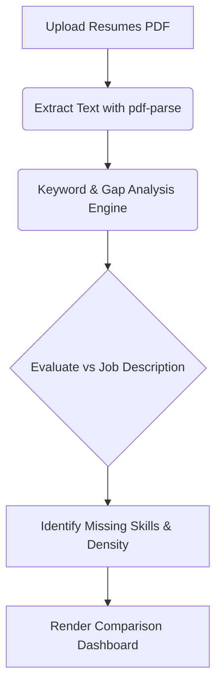

# Resume/CV Analyzer

A web application for comparing PDF resumes against job descriptions.

## Features
- **File Parsing**: Extracts text from PDF files using `pdf-parse`.
- **Comparison**: Displays multiple resumes side-by-side.
- **Keyword Analysis**: Calculates keyword matches and flags missing terms from a provided job description.
- **Stateless Operation**: Requires user-provided API keys per session.

## Workflow Architecture



## Directory Structure

```text
/
├── app/               # Next.js App Router
├── components/        # Upload Forms, Dashboard, Comparison UI
├── lib/               # Parsing Utilities & Analysis Engine
├── public/            # Static Assets
└── package.json       # Dependencies & Scripts
```

## Tech Stack
- **Framework**: Next.js 15 (App Router + Turbopack)
- **Animations**: Framer Motion
- **Styling**: Tailwind CSS
- **PDF Parsing**: `pdf-parse`

## Getting Started

```bash
git clone https://github.com/GaneshArwan/AIResumeCVAnalyzer.git
cd AIResumeCVAnalyzer
npm install --legacy-peer-deps
npm run dev
```

## Security Note
- API keys are passed in the request body and not stored in a database.
- Validates base URLs to mitigate SSRF.
- Validates external responses against Zod schemas.

## License

MIT License © 2026 GaneshArwan
